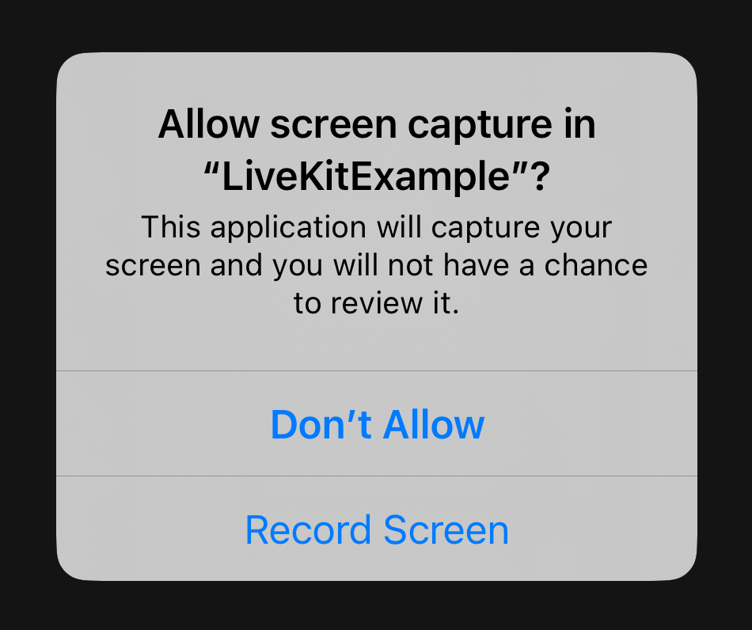
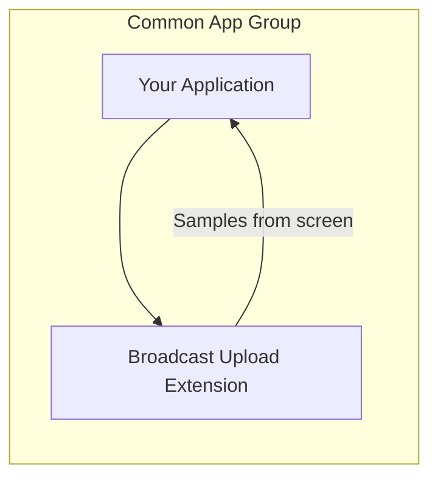
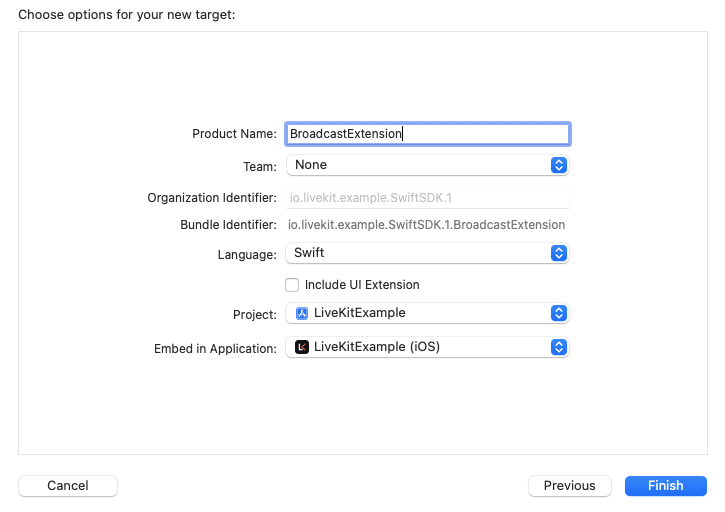

# iOS Screen Sharing

LiveKit integrates with [ReplayKit](https://developer.apple.com/documentation/replaykit/) to support screen sharing on iOS.  There are two capture modes available depending on the requirements of your app:

- **In-app Capture (default)**: Share screen content within your app.
- **Broadcast Capture**: Share screen content even when users switch to other apps.

## In-app Capture

By default, LiveKit uses the In-app Capture mode, which requires no additional configuration. In this mode, when screen sharing is enabled, the system prompts the user with a screen recording permission dialog. Once granted, a screen share track is published. The user only needs to grant permission once per app execution. Application audio is not supported with the In-App Capture mode.

<center>
    <figure>
        
        <figcaption>Permission Dialog</figcaption>
    </figure>
</center>

## Broadcast Capture

In this mode, when screen sharing is enabled, the system will present the user with a "Screen Broadcast" dialog. To start broadcasting, the user must tap "Start Broadcast." If the user taps outside the dialog, the operation is canceled. This dialog will be presented each time screen sharing is requested.

<center>
    <figure>
        
        <figcaption>Screen Broadcast Dialog</figcaption>
    </figure>
</center>


In order to capture system-wide screen content, ReplayKit requires a Broadcast Upload Extension—a separate process responsible for delivering samples to your app. This architecture is conceptually illustrated below:



### Setup Guide

To use the Broadcast Capture mode, follow these steps to add a Broadcast Upload Extension target and associated configuration to your project. You can also refer to the [example app](https://github.com/livekit-examples/swift-example), which demonstrates this configuration.


#### 1. Add Broadcast Upload Extension Target



1. In Xcode, Choose "File" > "New > "Target"
2. From the template chooser, select "Broadcast Upload Extension"
3. Name the extension (e.g. "BroadcastExtension").
4. Press "Finish"
5. From the "Signing & Capabilities" tab of the new target, change the bundle identifier to be the same as your main app with `.broadcast` added to the end. To use a custom identifier, see *[Custom Identifiers](#custom-identifiers)* below.
6. Replace the default content of `SampleHandler.swift` in the new target with the following:

```swift
import LiveKit

#if os(iOS)
@available(macCatalyst 13.1, *)
class SampleHandler: LKSampleHandler {
    override var enableLogging: Bool { true }
}
#endif
````

<small>Note: Overriding the `enableLogging` property to return `true` will bootstrap the logging system in the extension's process, making log messages available through the macOS Console app for troubleshooting.</small>

#### 2. Add Targets to Common App Group

In order for the broadcast extension to communicate with your app, they must be members of the same app group. To enable this, perform the following steps for **both** your primary app target and broadcast extension target:

1. In the Project Editor, select the target.
2. Select the "Signing & Capabilities" tab and press the "+ Capability" button.
3. Add the "App Groups" capability.
4. Press "+" to add a new app group.
5. Add the target to the group `group.<main-app-bundle-id>`. To use a custom identifier, see *[Custom Identifiers](#custom-identifiers)* below.

#### 3. Begin Screen Share

With setup of the broadcast extension complete, broadcast capture will be used by default when enabling screen share:
```swift
try await room.localParticipant.setScreenShare(enabled: true)
```

<small>Note: When using broadcast capture, custom capture options must be set as room defaults rather than passed when enabling screen share with `set(source:enabled:captureOptions:publishOptions:)`.</small>

### Application Audio

When using Broadcast Capture, you can capture app audio even when the user navigates away from your app. When enabled, the captured app audio is mixed with the local participant's microphone track. To enable this feature, set the default screen share capture options when connecting to the room:


```swift
let roomOptions = RoomOptions(
    defaultScreenShareCaptureOptions: ScreenShareCaptureOptions(
        appAudio: true // enables capture of app audio
    )
)

// Option 1: Using SwiftUI RoomScope component
RoomScope(url: wsURL, token: token, enableMicrophone: true, roomOptions: roomOptions) {
    // your components here
}

// Option 2: Using Room object directly
try await room.connect(
    url: wsURL,
    token: token,
    roomOptions: roomOptions
)
try await room.localParticipant.setMicrophone(enabled: true)
```

### Troubleshooting

While running your app in a debug session in Xcode, check the debug console for errors and use the Console app to inspect logs from the broadcast extension:

1. Launch the Console app.
2. Select your iOS device from the left sidebar and press "Start Streaming."
3. In the search bar, add a filter for messages with a category of "LKSampleHandler."
4. Initiate a screen share in your app and inspect Console for errors.

### Advanced Usage

#### Manual Track Publication

When using broadcast capture, a broadcast can be initiated externally (for example, via control center). By default, when a broadcast begins, the local participant automatically publishes a screen share track. In some cases, however, you may want to handle track publication manually. You can achieve this by using `BroadcastManager`:

First, disable automatic track publication:
```swift
BroadcastManager.shared.shouldPublishTrack = false
```

Then, use one of the two methods for detecting changes in the broadcast state:

##### Combine Publisher
```swift
let subscription = BroadcastManager.shared
    .isBroadcastingPublisher
    .sink { isBroadcasting in
        // Manually handle track publication
    }
```

##### Delegate
```swift
class MyDelegate: BroadcastManagerDelegate {
    func broadcastManager(didChangeState isBroadcasting: Bool) {
        // Manually handle track publication
    }
}
BroadcastManager.shared.delegate = MyDelegate()
```

#### Custom Identifiers

By default, the app group identifier is expected to be `group.<main-app-bundle-id>`, and the broadcast extension's bundle identifier is expected to be `<main-app-bundle-id>.broadcast`.
To override these values, set `RTCAppGroupIdentifier` in Info.plist for both targets (both broadcast extension and main app), and set `RTCScreenSharingExtension` in Info.plist for your main app.
