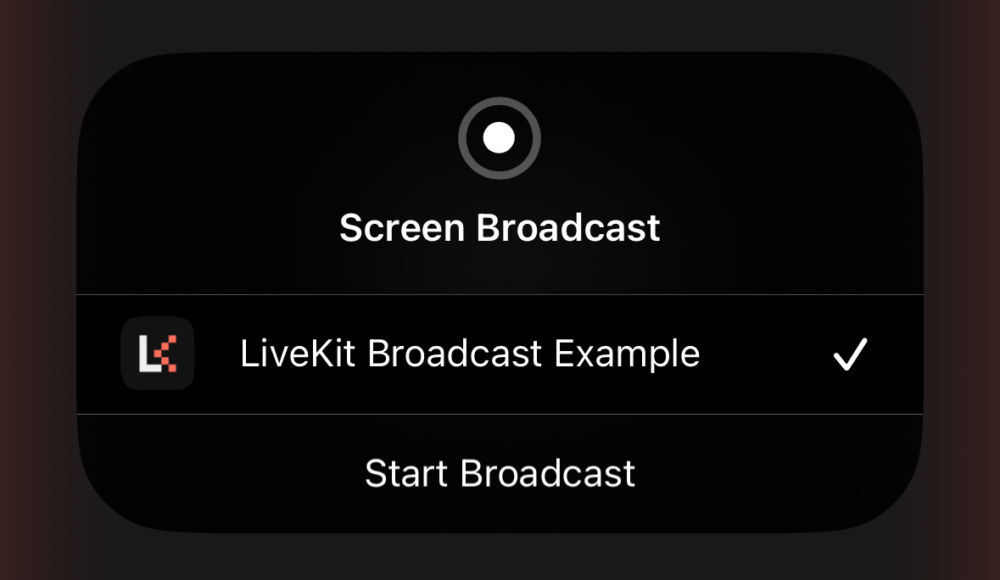

# iOS Screen Sharing

LiveKit integrates with [ReplayKit](https://developer.apple.com/documentation/replaykit/) to support screen sharing on iOS.  There are two capture modes available depending on the requirements of your app:

- **In-app Capture (default)**: Share screen content within your app.
- **Broadcast Capture**: Share screen content even when users switch to other apps.

## In-app Capture

By default, LiveKit uses the In-app Capture mode, which requires no additional configuration. In this mode, when screen sharing is enabled, the system prompts the user with a screen recording permission dialog. Once granted, a screen share track is published. The user only needs to grant permission once per app execution.

<center>
    <figure>
        
        <figcaption>Permission Dialog</figcaption>
    </figure>
</center>

## Broadcast Capture

In this mode, when screen sharing is enabled, the system will present the user with a "Screen Broadcast" dialog. To start broadcasting, the user must tap "Start Broadcast." If the user taps outside the dialog, the operation is canceled. This dialog will be presented each time screen sharing is requested.

<center>
    <figure>
        
        <figcaption>Screen Broadcast Dialog</figcaption>
    </figure>
</center>


In order to capture system-wide screen content, ReplayKit requires a Broadcast Upload Extension—a separate process responsible for delivering samples to your app. This architecture is conceptually illustrated below:


### Setup Guide

To use the Broadcast Capture mode, follow these steps to add a Broadcast Upload Extension target and associated configuration to your project. You can also refer to the [example app](https://github.com/livekit-examples/swift-example), which demonstrates this configuration.

#### 1. Add Broadcast Upload Extension Target


1. In Xcode, Choose "File" > "New > "Target"
2. From the template chooser, select "Broadcast Upload Extension"
3. Name the extension (e.g. "BroadcastExtension"). Take note of the extension's bundle identifier, as it will be needed later.
4. Replace the default content of `SampleHandler.swift` in the new target with the following:

```swift
import LiveKit

#if os(iOS)
@available(macCatalyst 13.1, *)
class SampleHandler: LKSampleHandler {
    override var enableLogging: Bool { true }
}
#endif
````

<small>Note: Overriding the `enableLogging` property to return `true` will bootstrap the logging system in the extension's process, making log messages available through the macOS Console app for troubleshooting.</small>

#### 2. Add Targets to Common App Group

In order for the broadcast extension to communicate with your app, they must be members of the same app group. To enable this, perform the following steps for **both** your primary app target and broadcast extension target:

1. In the Project Editor, select the target.
2. Select the "Signing & Capabilities" tab and press the "+ Capability" button.
3. Add the "App Groups" capability.
4. Press "+" to add a new app group.
5. Enter an app group identifier in the format `group.<domain>.<group_name>`. Be sure to use the same identifier for both targets.

#### 3. Add Properties to Info.plist

1. Set `RTCAppGroupIdentifier` in the Info.plist of **both targets** to the group identifier from the previous step.
2. Set `RTCScreenSharingExtension` in the Info.plist of your **primary app target** to the broadcast extension's bundle identifier.

#### 4. Use Broadcast Extension

To use the broadcast extension for screen sharing, create an instance of `ScreenShareCaptureOptions`, setting the `useBroadcastExtension` property to `true`. The following example demonstrates making this the default for a room when connecting:

```swift
let options = RoomOptions(
    defaultScreenShareCaptureOptions: ScreenShareCaptureOptions(
        useBroadcastExtension: true
    ),
    // other options...
)
room.connect(url: wsURL, token: token, roomOptions: options)
```

When connecting to a room declaratively using the `RoomScope` view from the SwiftUI components package, use the initializer's optional `roomOptions` parameter to pass the room options object:

```swift
RoomScope(url: wsURL, token: token, roomOptions: options) {
    // your components here
}
```

It is also possible to use the broadcast extension when enabling screen share without making it the default for the room:

```swift
try await room.localParticipant.set(
    source: .screenShareVideo,
    enabled: true,
    captureOptions: ScreenShareCaptureOptions(useBroadcastExtension: true)
)
```

### Troubleshooting

While running your app in a debug session in Xcode, check the debug console for errors and use the Console app to inspect logs from the broadcast extension:

1. Launch the Console app.
2. Select your iOS device from the left sidebar and press "Start Streaming."
3. In the search bar, add a filter for messages with a category of "LKSampleHandler."
4. Initiate a screen share in your app and inspect Console for errors.
